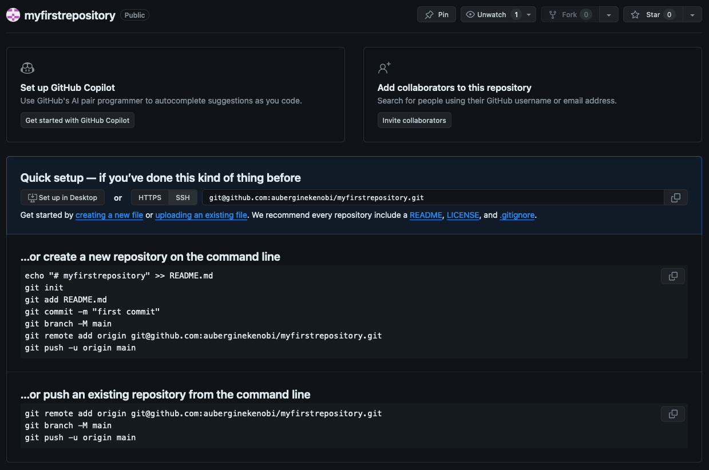

Author: Owen Chapman  
Last updated: 2024-07-25

## Goal
This tutorial goes over the basics of using `git` on the command line to save, revise, and distribute code via a GitHub repository. Here we cover a simple use case of a single developer working from a single machine. Using `git` can also facilitate collaborative software development, but we will cover that in a later tutorial.

## Requirements
- `git` ([Install git](https://git-scm.com/book/en/v2/Getting-Started-Installing-Git))
- a GitHub account ([Create a GitHub account](https://github.com/))
- `ssh` 

## Tutorial
0. *Configure GitHub to authenticate using `ssh`.* You only have to set up `ssh` once before the first time you push code to GH from a new machine. Follow the instructions at https://docs.github.com/en/authentication/connecting-to-github-with-ssh:
   - [check for existing ssh keys](https://docs.github.com/en/authentication/connecting-to-github-with-ssh/checking-for-existing-ssh-keys)
   - [create a new ssh key](https://docs.github.com/en/authentication/connecting-to-github-with-ssh/generating-a-new-ssh-key-and-adding-it-to-the-ssh-agent)
   - [add the key to your GH account](https://docs.github.com/en/authentication/connecting-to-github-with-ssh/adding-a-new-ssh-key-to-your-github-account)
   - [test your ssh connection](https://docs.github.com/en/authentication/connecting-to-github-with-ssh/testing-your-ssh-connection)
1. *Write some code.* Maybe you already have a directory containing code you wish to push to version control. For this tutorial, we will be committing python code in the local directory `~/myusername/software/myfirstrepository/`. Create the file `helloworld.py` there with the following text contents:
   ```
   #!/usr/bin/env python3
   print("Hello world!")
   ```
2. *Create a new git repository on GitHub.* From your GitHub homepage at https://github.com/myghusername, click 'Repositories', then 'New'. Name it, select your preferred settings, and click 'Create'. You will be redirected to your new repository homepage, which for us is located at https://github.com/myghusername/myfirstrepository:
   
3. *Create a new local git repository and link it to GitHub.* We will be following the middle block of instructions entitled 'create a new repository on the command line'. On your local command line, substituting your username, repo name, etc.:
   ```
   cd ~/myusername/software/myfirstrepository # navigate to the location of your local code
   git init # create the local repo
   git remote add origin git@github.com:myghusername/myfirstrepository.git # link the local repo to your GH repo
   git status # this command is optional and will print the current state of your new repo
   ```
   Note that anything after the `#` in a line is a comment and not a required part of the command.
6. *Push your code to GH.* `git` will only track files you tell it to track. First we will *stage* and *commit* code revisions to our local repo, and then we will *push* these changes to the remote repo on GH:
   ```
   git add helloworld.py # stage the files you will include in the commit
   git commit -m "A short description of the change(s), eg. new greeting script"
   git push --set-upstream origin main
   ```
   Note that the first push requires that you set the `--set-upstream` flag, but subsequent pushes can be done with just `git push`.  
   Here's a helpful diagram by Shuai Li of what we just did:
   
7. *Set up a `.gitignore` file.* It is best practice to use version control for source code **only**, and not for large, binary, or temporary files. In this step we will demonstrate the use of a `.gitignore` file to control what files can and cannot be added to your repo.
   Let's start by creating a dummy file representing a large data file we do not want to add to version control:
   ```
   mkdir data
   touch data/pretend-this-file-is-really-large.txt
   git status # note that git finds the new data directory but that it is untracked.
   ```
   I like to keep my project data within the `data` subfolder of my local project directory, but I don't want to add these files to my git repo. To ignore it, we will add the following line to the `.gitignore` file (create this file if it doesn't exist):
   ```
   data/*
   ```
   Now, running `git status` will detect your change to the .gitignore file, but will no longer list the data directory. Commit and push your update:
   ```
   git add .gitignore
   git commit -m "ignore data directory"
   git push
   ```
## FAQ
**What is `git`?** `git` is an open-source command-line tool for software *version control*. Placing your code in a version-controlled repository allows you to roll back (and forward) your code so you can make revisions without fear of destroying functioning code you
may have already written.  
**What is GitHub?** GitHub is a cloud service, owned by Microsoft, for hosting `git` repositories. 
